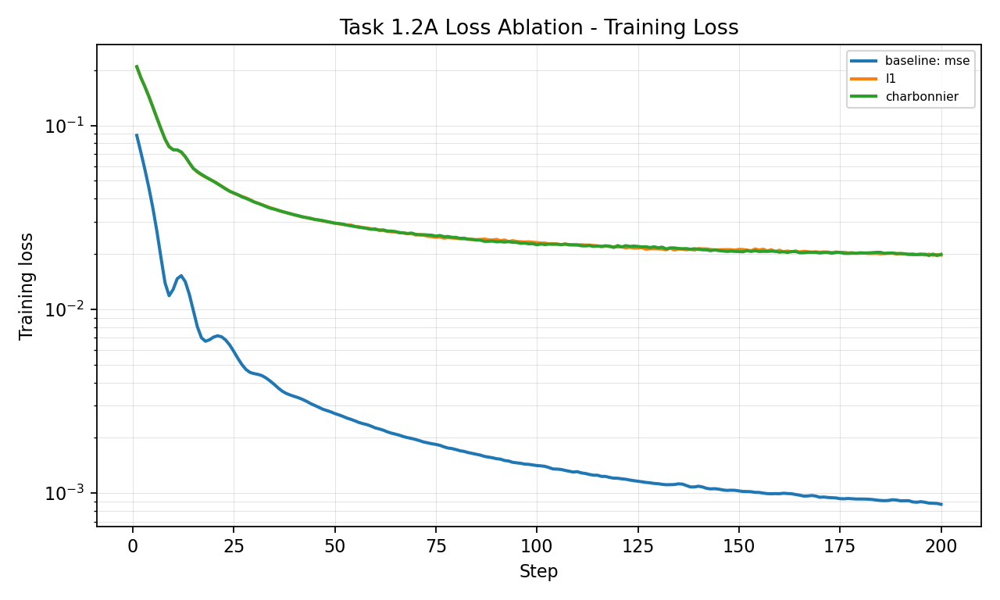
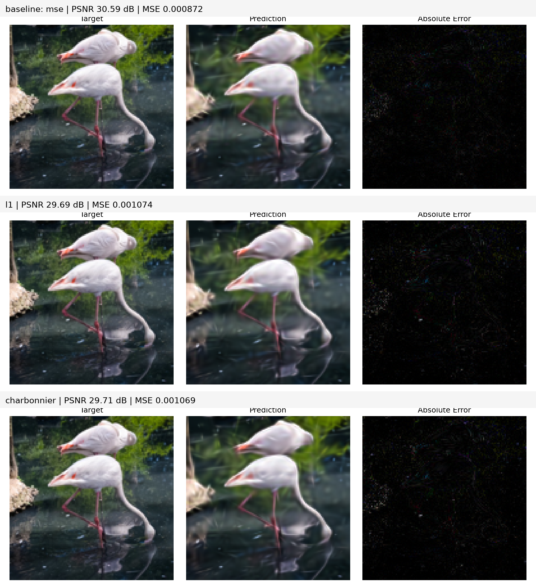
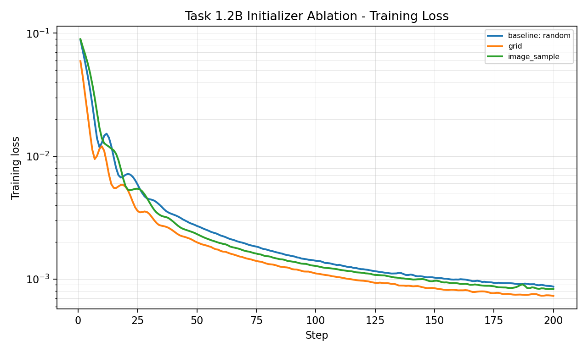
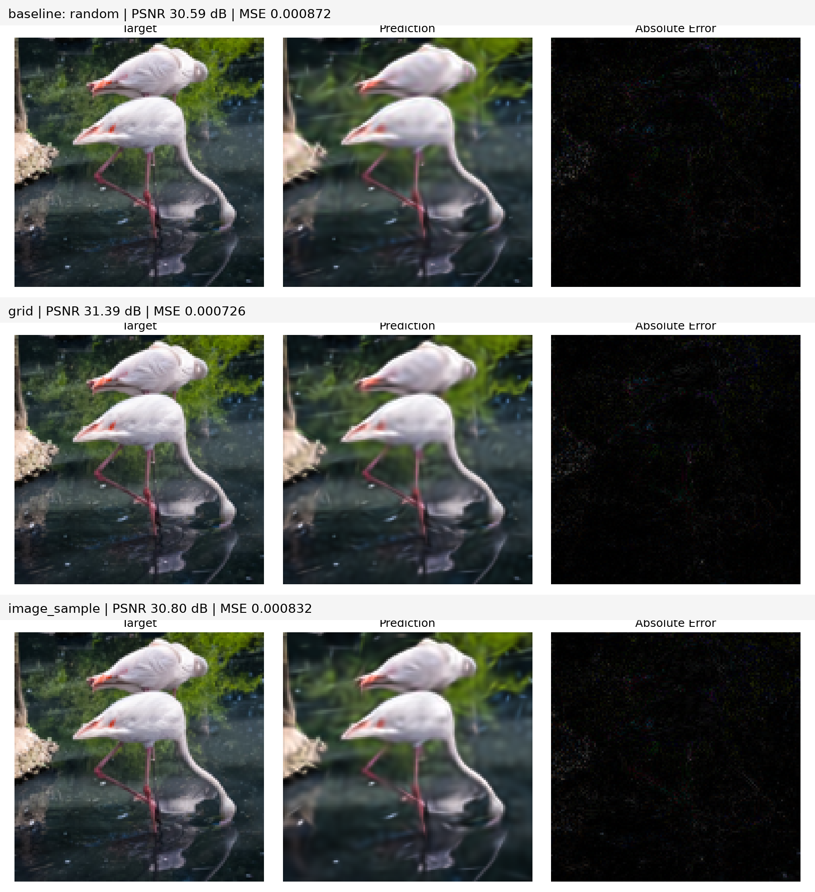
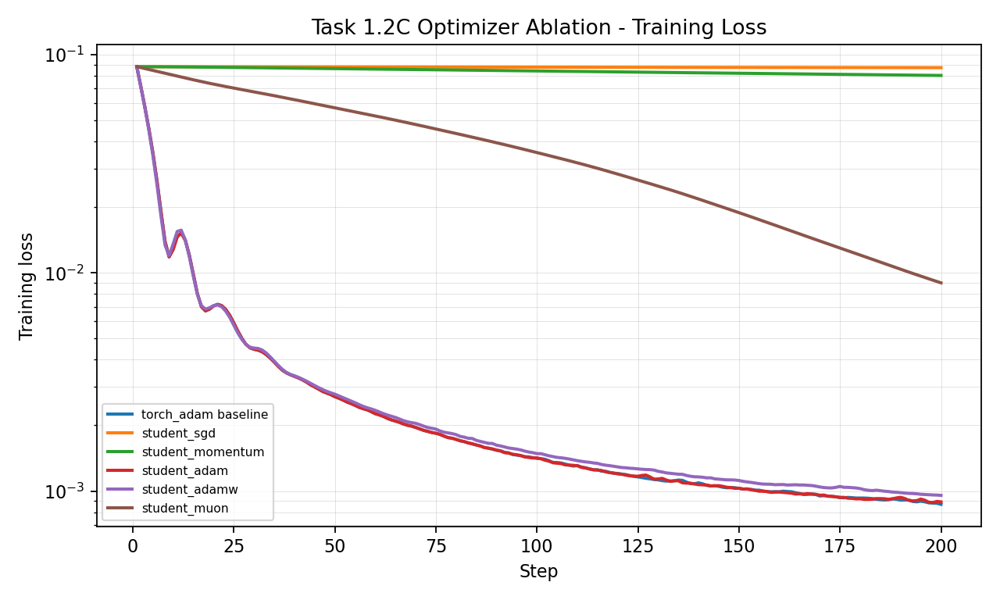
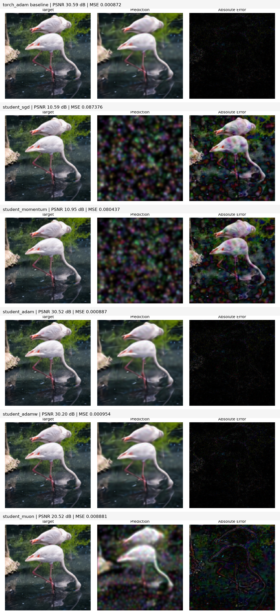
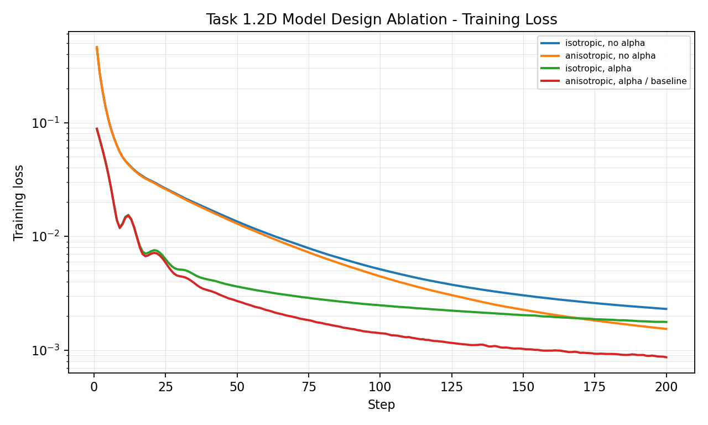
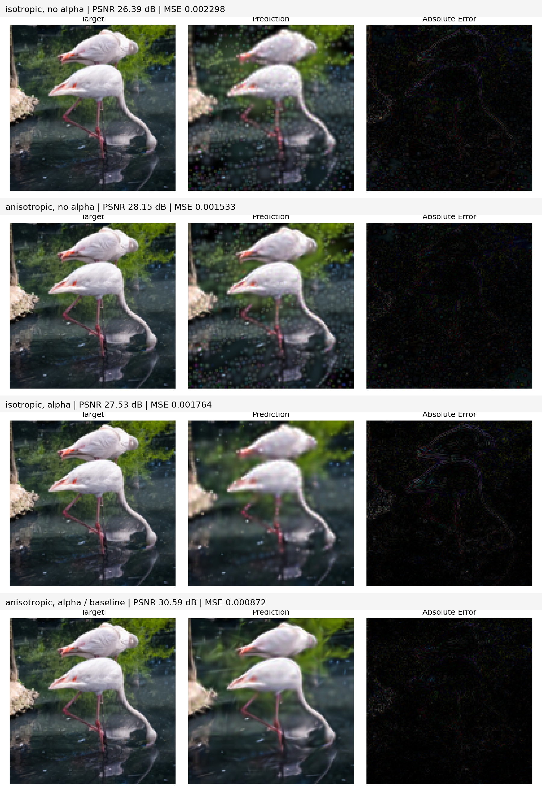
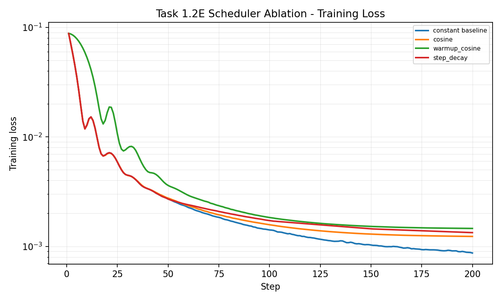
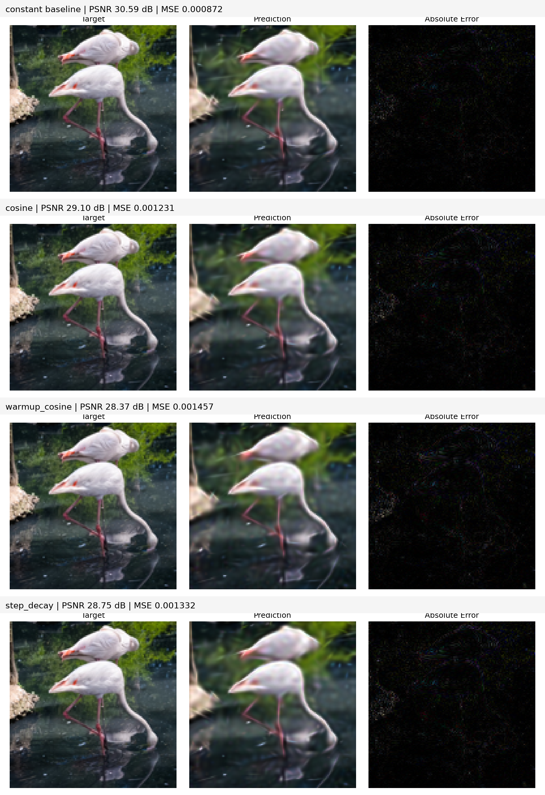

# CM2026 Project 1 实验报告草稿

## 实验设置

本实验在默认配置基础上完成 2D Gaussian 图像拟合。任务 1.2 消融实验统一使用 `data/real_images/r1_flamingo_128.png`、`128 x 128`、`1000` 个高斯、`200` 步、随机种子 `42`。默认基线为 `mse` loss、`random` 初始化、`torch_adam` 优化器、`constant` 学习率、开启各向异性与 alpha。

已实现模块包括：

- Loss：`l1`、`charbonnier`、`mse_l1`、`mse_edge`
- Optimizer：`student_sgd`、`student_momentum`、`student_adam`、`student_adamw`、`student_muon`
- Initializer：`grid`、`image_sample`
- Scheduler：`cosine`、`warmup_cosine`、`step_decay`

## 任务 1.2 消融结果

结果由 `python experiments/run_ablation.py --output outputs_ablation` 生成，原始数值位于 `outputs_ablation/summary.csv`，每个实验的逐步 loss 位于对应子目录的 `losses.csv`。为方便后续排版，本报告不直接插入图片，而是在每个小节放置图片占位符；对应的候选图片已整理到 `report_assets/task1_2/`。

除被消融的模块外，所有实验均保持默认基线配置：`data/real_images/r1_flamingo_128.png`、`128 x 128`、`1000` 个高斯、`200` 步、随机种子 `42`、`mse` loss、`random` 初始化、`torch_adam`、`constant` scheduler、开启各向异性和 alpha。评价指标统一报告 `PSNR / MSE / MAE`，其中 PSNR 越高越好，MSE 和 MAE 越低越好。

### 总览

| 实验 | 配置 | PSNR | ΔPSNR | MSE | MAE |
| --- | --- | ---: | ---: | ---: | ---: |
| Baseline | mse + random + torch_adam + constant | 30.5935 | +0.0000 | 0.00087226 | 0.01990399 |
| 1.2A Loss | l1 | 29.6914 | -0.9021 | 0.00107364 | 0.01967952 |
| 1.2A Loss | charbonnier | 29.7096 | -0.8839 | 0.00106915 | 0.01959821 |
| 1.2B Init | grid | 31.3897 | +0.7962 | 0.00072616 | 0.01820099 |
| 1.2B Init | image_sample | 30.7968 | +0.2033 | 0.00083238 | 0.02033302 |
| 1.2C Optimizer | student_sgd | 10.5861 | -20.0075 | 0.08737649 | 0.20757923 |
| 1.2C Optimizer | student_momentum | 10.9455 | -19.6481 | 0.08043657 | 0.19914857 |
| 1.2C Optimizer | student_adam | 30.5219 | -0.0716 | 0.00088677 | 0.02007134 |
| 1.2C Optimizer | student_adamw | 30.2050 | -0.3885 | 0.00095389 | 0.02062576 |
| 1.2C Optimizer | student_muon | 20.5155 | -10.0780 | 0.00888071 | 0.07253133 |
| 1.2D Model | isotropic + no alpha | 26.3870 | -4.2066 | 0.00229775 | 0.03550264 |
| 1.2D Model | anisotropic + no alpha | 28.1458 | -2.4477 | 0.00153256 | 0.02941568 |
| 1.2D Model | isotropic + alpha | 27.5348 | -3.0587 | 0.00176407 | 0.02745778 |
| 1.2D Model | anisotropic + alpha | 30.5935 | +0.0000 | 0.00087226 | 0.01990399 |
| 1.2E Scheduler | cosine | 29.0972 | -1.4964 | 0.00123107 | 0.02333520 |
| 1.2E Scheduler | warmup_cosine | 28.3661 | -2.2274 | 0.00145676 | 0.02514262 |
| 1.2E Scheduler | step_decay | 28.7539 | -1.8396 | 0.00133232 | 0.02418082 |

### 1.2A Loss 函数消融

本组只替换 loss，其余配置保持基线。由于 `l1`、`charbonnier` 和 `mse` 的优化目标尺度不同，loss 曲线主要用于观察收敛趋势，最终质量以统一计算的 PSNR、MSE、MAE 为准。

| Loss | PSNR | ΔPSNR | MSE | MAE | 训练 loss@200 |
| --- | ---: | ---: | ---: | ---: | ---: |
| mse baseline | 30.5935 | +0.0000 | 0.00087226 | 0.01990399 | 0.00086891 |
| l1 | 29.6914 | -0.9021 | 0.00107364 | 0.01967952 | 0.01971452 |
| charbonnier | 29.7096 | -0.8839 | 0.00106915 | 0.01959821 | 0.01990113 |





`l1` 和 `charbonnier` 的 MAE 略低于 MSE 基线，说明它们确实更直接地压低平均绝对误差；但二者的 PSNR 分别低 `0.9021 dB` 和 `0.8839 dB`。PSNR 由 MSE 推导而来，因此当最终评分更关注均方误差时，直接优化 `mse` 更匹配评价目标。视觉上，鲁棒损失对大残差区域的惩罚更弱，容易保留局部高误差，从而使重建图的误差图更明显。

### 1.2B 初始化策略消融

本组只替换初始化策略，其余配置保持基线。初始化的重点观察前 50 步收敛速度以及最终 PSNR。

| Initializer | PSNR | ΔPSNR | MSE | MAE | 训练 loss@50 | 训练 loss@200 |
| --- | ---: | ---: | ---: | ---: | ---: | ---: |
| random baseline | 30.5935 | +0.0000 | 0.00087226 | 0.01990399 | 0.00270904 | 0.00086891 |
| grid | 31.3897 | +0.7962 | 0.00072616 | 0.01820099 | 0.00199363 | 0.00073103 |
| image_sample | 30.7968 | +0.2033 | 0.00083238 | 0.02033302 | 0.00232506 | 0.00082997 |





`grid` 初始化在第 50 步的训练 loss 已经低于 random 基线，最终 PSNR 也提升 `0.7962 dB`，是本组最有效的初始化。原因是网格能让高斯一开始均匀覆盖整张图，减少 random 初始化中局部没有高斯覆盖的区域。`image_sample` 也比 random 高 `0.2033 dB`，说明利用目标颜色和图像分布能加速拟合；但在这张单图上，它弱于 `grid`，可能因为采样更集中在高响应区域，早期覆盖均匀性不如网格。

### 1.2C 优化器消融

本组只替换优化器，其余配置保持基线。`torch_adam` 是参考基线，`student_adam` 用于检查手写 Adam 是否与参考实现接近。

| Optimizer | PSNR | ΔPSNR | MSE | MAE | 训练 loss@50 | 训练 loss@200 |
| --- | ---: | ---: | ---: | ---: | ---: | ---: |
| torch_adam baseline | 30.5935 | +0.0000 | 0.00087226 | 0.01990399 | 0.00270904 | 0.00086891 |
| student_sgd | 10.5861 | -20.0075 | 0.08737649 | 0.20757923 | 0.08806213 | 0.08738101 |
| student_momentum | 10.9455 | -19.6481 | 0.08043657 | 0.19914857 | 0.08648667 | 0.08047271 |
| student_adam | 30.5219 | -0.0716 | 0.00088677 | 0.02007134 | 0.00270901 | 0.00089127 |
| student_adamw | 30.2050 | -0.3885 | 0.00095389 | 0.02062576 | 0.00278072 | 0.00095532 |
| student_muon | 20.5155 | -10.0780 | 0.00888071 | 0.07253133 | 0.05717371 | 0.00900617 |





`student_adam` 与 `torch_adam` 最接近，PSNR 仅低 `0.0716 dB`，第 50 步 loss 也几乎相同，说明一阶矩、二阶矩和 bias correction 的实现基本正确。`student_sgd` 和 `student_momentum` 几乎没有有效下降，原因是本任务同时优化位置、尺度、颜色、alpha，不同参数的梯度尺度差异较大，固定全局学习率很难兼顾所有参数。`student_adamw` 略低于 Adam，说明 decoupled weight decay 在该图像拟合任务中不是主要收益来源，反而会轻微限制参数拟合能力。`student_muon` 明显优于 SGD/Momentum 但弱于 Adam，符合 Muon 更适合大矩阵神经网络权重，而本项目参数多为 `[N, 2]`、`[N, 3]` 小矩阵的预期。

### 1.2D 模型设计消融

本组不实现新代码，只切换 `use_anisotropic` 和 `use_alpha`。四个组合中 `anisotropic + alpha` 等同默认模型基线。

| Model setting | use_anisotropic | use_alpha | PSNR | ΔPSNR | MSE | MAE |
| --- | --- | --- | ---: | ---: | ---: | ---: |
| isotropic + no alpha | False | False | 26.3870 | -4.2066 | 0.00229775 | 0.03550264 |
| anisotropic + no alpha | True | False | 28.1458 | -2.4477 | 0.00153256 | 0.02941568 |
| isotropic + alpha | False | True | 27.5348 | -3.0587 | 0.00176407 | 0.02745778 |
| anisotropic + alpha baseline | True | True | 30.5935 | +0.0000 | 0.00087226 | 0.01990399 |





各向异性和 alpha 都能单独提升结果：在没有 alpha 时，开启各向异性把 PSNR 从 `26.3870` 提升到 `28.1458`；在各向同性下，开启 alpha 把 PSNR 从 `26.3870` 提升到 `27.5348`。二者同时开启达到 `30.5935`，高于任一单独开关，说明它们具有互补性。各向异性增强了对细长边缘和局部方向结构的表达能力，alpha 则让每个高斯可以控制贡献强度，降低颜色和密度之间的耦合。

### 1.2E 学习率调度器消融

本组只替换 scheduler，其余配置保持基线。重点观察中后期收敛行为和最终 PSNR。

| Scheduler | PSNR | ΔPSNR | MSE | MAE | 训练 loss@100 | 训练 loss@200 |
| --- | ---: | ---: | ---: | ---: | ---: | ---: |
| constant baseline | 30.5935 | +0.0000 | 0.00087226 | 0.01990399 | 0.00141177 | 0.00086891 |
| cosine | 29.0972 | -1.4964 | 0.00123107 | 0.02333520 | 0.00157500 | 0.00123158 |
| warmup_cosine | 28.3661 | -2.2274 | 0.00145676 | 0.02514262 | 0.00183359 | 0.00145736 |
| step_decay | 28.7539 | -1.8396 | 0.00133232 | 0.02418082 | 0.00171966 | 0.00133431 |





三个调度器都没有超过 `constant`。本任务每一步使用整张图像计算 loss，不存在 minibatch 训练中的随机梯度噪声；同时 Adam 已经为不同参数提供自适应步长。Cosine、Warmup+Cosine 和 Step Decay 都会在中后期降低有效学习率，使最后阶段对位置、尺度和颜色的小幅修正不足，最终 MSE 高于 constant。Warmup+Cosine 最弱，主要是 200 步预算较短，warmup 消耗了早期快速下降的步数。

### 可靠性说明

本组消融严格使用同一张图、同一随机种子和同一训练步数，每个子实验只改变文档指定的一个模块，因此可以比较不同设计在相同条件下的相对影响。不过当前结果只覆盖 `r1_flamingo_128.png` 和 seed `42`，没有做多 seed 或多图平均；因此 1.2 的结论适合作为本作业指定设置下的解释，泛化到任务 2 多图设置时仍需结合任务 2 的独立自测结果判断。

## 任务 2 配置与结果

任务 2 的目标是在 6 张测试图像上最大化平均 PSNR。硬约束保持不变：`1000` 个高斯、随机种子 `42`、图像大小 `128 x 128`、黑色背景。最终配置仍使用 `image_sample` 初始化、`mse` loss、`torch_adam` 优化器、`constant` scheduler，并开启各向异性和 alpha；主要调参集中在基础学习率和参数组学习率倍率。

| Track | steps | loss | initializer | optimizer | base lr | center | scale | rotation | alpha | color | scheduler |
| --- | ---: | --- | --- | --- | ---: | ---: | ---: | ---: | ---: | ---: | --- |
| Task2A sprint | 100 | `mse` | `image_sample` | `torch_adam` | 0.10 | 0.5 | 1.0 | 1.0 | 2.0 | 2.0 | `constant` |
| Task2B standard | 500 | `mse` | `image_sample` | `torch_adam` | 0.04 | 0.5 | 1.0 | 1.0 | 2.0 | 2.0 | `constant` |

最终自测命令：

```bash
python experiments/run_assignment2.py --track both --output outputs_assignment2_final
```

| Track | R1 Flamingo | R2 Starry Night | R3 Parkour | S1 Night Cityscape | S2 Mandala | S3 Coral Reef | 平均 PSNR | 估计得分 |
| --- | ---: | ---: | ---: | ---: | ---: | ---: | ---: | ---: |
| Task2A 100 steps | 30.7566 | 27.5554 | 29.0633 | 29.3847 | 35.1642 | 30.8492 | 30.4622 | 15 / 15 |
| Task2B 500 steps | 33.5201 | 29.2998 | 32.1483 | 35.0358 | 43.2216 | 37.4549 | 35.1134 | 15 / 15 |

按 `docs/assignment2.md` 的阈值，Task2A 平均 PSNR 高于 `29.5 dB`，Task2B 平均 PSNR 高于 `33.5 dB`，因此两项均达到满分线。

调参时，单纯使用 460397c 中的配置只能得到 Task2A `28.6870 dB`、Task2B `33.3852 dB`，分别约为 `9 / 15` 和 `12 / 15`。最终配置的关键改动是降低中心参数学习率，同时提高 alpha 和颜色参数学习率。中心位置在 100 步和 500 步中都不宜过度震荡，因此使用 `center_lr_scale=0.5`；颜色和 alpha 直接决定像素强度，更高的 `2.0` 倍率可以更快匹配目标外观。100 步 sprint 使用较大的 `0.10` 基础学习率以提高早期收敛速度；500 步 standard 使用较稳的 `0.04`，避免长训练中合成图过冲。

## 总结

本实验中最关键的设计是初始化、Adam 自适应优化、模型表达能力和参数组学习率。`grid` 对单张火烈鸟消融最优，`image_sample` 在任务 2 多图平均上更好，尤其能利用合成目标的颜色先验。各向异性和 alpha 明显提升表达能力；学习率调度器在该全量优化问题中收益不明显。任务 2 最终通过调整基础学习率和中心/alpha/颜色参数组倍率达到两个 track 的满分阈值。
